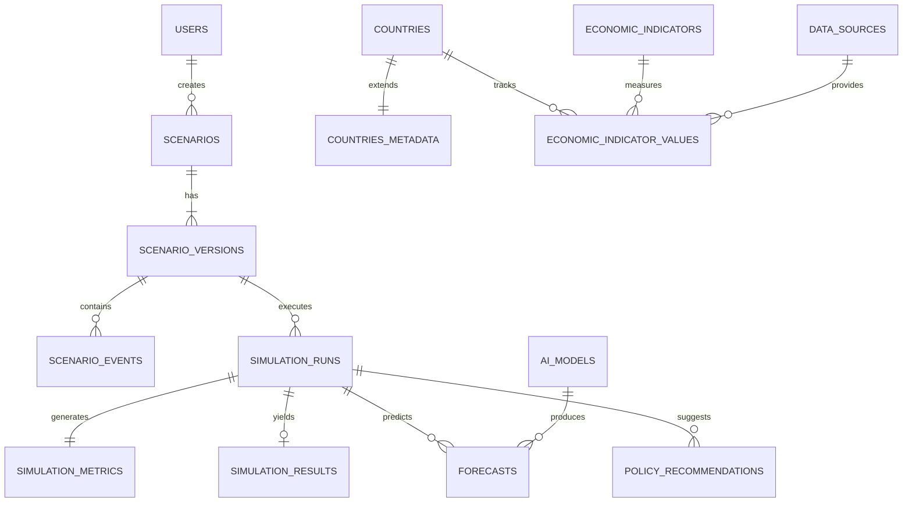

# Database Design Document
**Project:** EconoSphere AI - AI-Powered Economic Decision Intelligence Platform
**Role:** Principal Database Architect

---

## 1. Database Architecture Overview
EconoSphere AI employs a polyglot persistence architecture to handle distinct data workloads efficiently. A singular database technology cannot efficiently model complex graph traversals (global trade routes) while also maintaining ACID compliance for structured numerical time-series data (historical economic indicators). Thus, we separate concerns across three database engines.

## 2. Database Responsibilities
1. **PostgreSQL (The Source of Truth):** Relational data, user accounts, system configuration, flat historical time-series data, traceability, and audit logs.
2. **Neo4j (The Network Engine):** Deeply connected graph data. Maps the exact topology of global trade, supply chain dependencies, and geopolitical alliances.
3. **Redis (The Speed Layer):** High-throughput ephemeral data. Session management, rate limiting, task queues (for async AI jobs), and aggressive caching of heavy Postgres/Neo4j query results.

---

## 3. PostgreSQL Schema (Relational Design)
All tables adhere to 3rd Normal Form (3NF) to minimize redundancy while optimizing for reads.

### 3.1 `users`
*   **Purpose:** Core identity management.
*   **Columns:** `id` (UUID), `email` (VARCHAR), `password_hash` (VARCHAR), `role` (ENUM), `created_at` (TIMESTAMP).
*   **PK:** `id` | **Indexes:** `idx_users_email` (UNIQUE).

### 3.2 `countries`
*   **Purpose:** Static, lightweight identifiers for global economies.
*   **Columns:** `id` (UUID), `iso3` (CHAR(3)), `name` (VARCHAR).
*   **PK:** `id` | **Indexes:** `idx_countries_iso3` (UNIQUE).

### 3.3 `countries_metadata`
*   **Purpose:** Extensible, rarely changing information separated to keep `countries` lightweight.
*   **Columns:** `country_id` (UUID, FK), `iso2` (CHAR(2)), `capital` (VARCHAR), `flag_url` (VARCHAR), `time_zone` (VARCHAR), `region` (VARCHAR), `population` (BIGINT), `latitude` (NUMERIC), `longitude` (NUMERIC).
*   **PK:** `country_id` | **FK:** `country_id -> countries(id)`.

### 3.4 `currencies`
*   **Purpose:** Global currency mapping.
*   **Columns:** `id` (UUID), `code` (CHAR(3)), `name` (VARCHAR), `symbol` (VARCHAR).
*   **PK:** `id` | **Indexes:** `idx_currencies_code` (UNIQUE).

### 3.5 `data_sources`
*   **Purpose:** Transparency and traceability for economic metrics (e.g., World Bank, IMF, FRED, OECD).
*   **Columns:** `id` (UUID), `name` (VARCHAR), `url` (VARCHAR), `reliability_score` (INT).
*   **PK:** `id`

### 3.6 `economic_indicators`
*   **Purpose:** Master definitions of tracked metrics (e.g., GDP, Inflation, Unemployment).
*   **Columns:** `id` (UUID), `name` (VARCHAR), `unit` (VARCHAR), `description` (TEXT).
*   **PK:** `id`

### 3.7 `economic_indicator_values`
*   **Purpose:** Time-series history of economic data separated from definition.
*   **Columns:** `id` (UUID), `country_id` (UUID, FK), `indicator_id` (UUID, FK), `source_id` (UUID, FK), `date` (DATE), `value` (NUMERIC), `confidence` (NUMERIC).
*   **PK:** `id` | **FKs:** `country_id -> countries(id)`, `indicator_id -> economic_indicators(id)`, `source_id -> data_sources(id)`.
*   **Indexes:** `idx_eiv_country_date` (Compound).

### 3.8 `scenarios` & `scenario_versions`
*   **Purpose:** Scenarios allow versioning to prevent overwriting user iterations.
*   `scenarios`: `id` (UUID), `author_id` (UUID, FK), `name` (VARCHAR).
*   `scenario_versions`: `id` (UUID), `scenario_id` (UUID, FK), `version_num` (INT), `description` (TEXT), `created_at` (TIMESTAMP).
*   **PKs:** `id` | **FKs:** `author_id -> users(id)`, `scenario_id -> scenarios(id)`.

### 3.9 `scenario_events`
*   **Purpose:** Specific shock triggers inside a scenario version.
*   **Columns:** `id` (UUID), `scenario_version_id` (UUID, FK), `target_entity` (VARCHAR), `impact_multiplier` (NUMERIC).
*   **PK:** `id` | **FK:** `scenario_version_id -> scenario_versions(id)`.

### 3.10 `ai_models`
*   **Purpose:** Tracking forecasting models used (e.g., XGBoost vs Prophet).
*   **Columns:** `id` (UUID), `model_name` (VARCHAR), `version` (VARCHAR), `hyperparameters` (JSONB), `training_date` (TIMESTAMP), `accuracy_metrics` (JSONB).
*   **PK:** `id`

### 3.11 `simulation_runs`
*   **Purpose:** A specific execution instance of a scenario version.
*   **Columns:** `id` (UUID), `scenario_version_id` (UUID, FK), `user_id` (UUID, FK), `status` (ENUM), `started_at` (TIMESTAMP).
*   **PK:** `id` | **FKs:** `scenario_version_id -> scenario_versions(id)`.

### 3.12 `simulation_metrics`
*   **Purpose:** Store execution details and system telemetry per run.
*   **Columns:** `run_id` (UUID, FK), `runtime_ms` (INT), `cpu_usage` (NUMERIC), `memory_usage_mb` (INT), `accuracy_score` (NUMERIC), `confidence_score` (NUMERIC).
*   **PK:** `run_id` | **FK:** `run_id -> simulation_runs(id)`.

### 3.13 `simulation_results`
*   **Purpose:** Aggregated high-level output of a run.
*   **Columns:** `id` (UUID), `run_id` (UUID, FK), `summary_json` (JSONB).
*   **PK:** `id`

### 3.14 `forecasts`
*   **Purpose:** Detailed time-series predictions. References the AI model that produced it.
*   **Columns:** `id` (UUID), `run_id` (UUID, FK), `model_id` (UUID, FK), `country_id` (UUID, FK), `indicator_id` (UUID, FK), `predicted_date` (DATE), `predicted_value` (NUMERIC).
*   **PK:** `id` | **FKs:** `model_id -> ai_models(id)`.

### 3.15 `policy_recommendations`
*   **Purpose:** AI (LLM) generated mitigation strategies.
*   **Columns:** `id` (UUID), `run_id` (UUID, FK), `title` (VARCHAR), `rationale` (TEXT), `impact_score` (INT).
*   **PK:** `id`

### 3.16 `saved_simulations`, `reports`, `notifications`, `audit_logs`, `settings`
*   *(Standard structural tables matching earlier definitions for workspace management and system logging).*

---

## 4. PostgreSQL ER Diagram

---

## 5. Neo4j Graph Model
*(Remains focused on mapping topological data such as Country-[TRADES_WITH]->Country, resolving supply chain bottlenecks rapidly without relying on PostgreSQL JOINs).*

## 6. Redis Strategy
*(Remains focused on API caching, Session storage, and Celery Queueing for AI background processes).*
